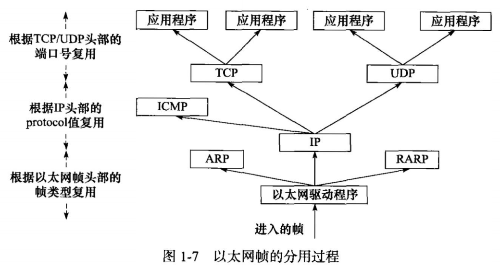
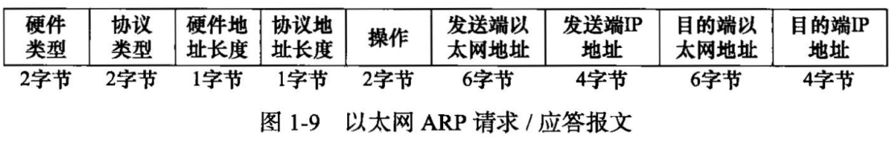

### 1.1.1数据链路层

数据链路层实现了网卡接口的网络驱动程序，处理数据在物理媒介上传输（以太网、令牌环等）


常用协议：

1. ARP（Address Resolve Protocol 地址解析协议）
2. RARP（Reverse Address Resolve Protocol 逆地址解析协议）

实现IP地址和机器物理地址（通常 MAC）之间互相转换


### 1.1.2 网络层

网络层实现数据包的选路和转发。

网络层对上层协议隐藏了网络拓扑连接的细节，使得传输层和应用层看来是通信双方直连


核心协议：

1. IP（Internet Protocol )IP协议根据数据包的目标IP地址来决定如何投递,如果不能直接发送到目标主机,则寻找下一跳(next hop)路由器,并将数据包交付给该路由来转发.
2. ICMP(Internet Control Message Protocol 因特网控制报文协议),补充IP,主要用于检测网络连接.


**8位类型**字段用于区分报文类型。它将ICMP报文分为两大类：

1. 差错报文，这类报文主要用来回应网络错误，比如目标不可到达（类型值为3）和重定向（类型值为5）;
2. 查询报文，这类报文用来查询网络信息，比如ping程序就是使用ICMP报文查看目标是否可到达（类型值为8）的。

有的ICMP报文还使用**8位代码**字段进一步细分不同的条件,如重定向报文使用代码值0表示对网络重定向，代码值1表示对主机重定向

ICMP报文使用16位校验和字段对整个报文（包括头部和内容部分）进行循环冗余校验（Cyclic Redundancy Check，CRC）,以检验报文在传输过程中是否损坏。


ICMP协议并非严格意义上的网络层协议，因为它使用处于同一层的IP协议提供的服务


### 1.1.3 传输层

传输层为两台主机上的应用程序提供端到端（end to end）的通信。


实线箭头表示TCP/IP协议族各层之间的实体通信

虚线箭头表示逻辑通信线路

传输层协议主要有三个：TCP协议、UDP协议和SCTP协议

1. TCP协议（Transmission Control Protocol,传输控制协议）为应用层提供可靠的、面向连接的和基于流（stream）的服务。
2. UDP协议（User Datagram Protocol,用户数据报协议）它为应用层提供不可靠、无连接和基于数据报的服务。
   * 使用UDP协议的应用程序通常要自己处理数据确认、超时重传等逻辑.
   * UDP协议是无连接的，即通信双方不保持一个长久的联系，因此应用程序每次发送数据都要明确指定接收端的地址（IP地址等信息）。
   * 基于数据报的服务，是相对基于流的服务而言的。每个UDP数据报都有一个长度，接收端必须以该长度为最小单位将其所有内容一次性读出，否则数据将被截断。
3. SCTP协议（Stream Control Transmission Protocol,流控制传输协议）是一种相对较新的传输层协议，它是为了在因特网上传输电话信号而设计的(略)

### 1.1.4 应用层

数据链路层、网络层和传输层负责处理网络通信细节，这部分必须既稳定又高效，因此它们都在内核空间中实现

而应用层则在用户空间实现，因为它负责处理众多逻辑，比如文件传输、名称查询和网络管理等

ping是应用程序，而不是协议，前面说过它利用ICMP报文检测网络连接，是调试网络环境的必备工具。
telnet协议是一种远程登录协议，它使我们能在本地完成远程任务，本书后续章节将会多次使用telnet客户端登录到其他服务上。
OSPF （Open Shortest Path First,开放最短路径优先）协议是一种动态路由更新协议，用于路由器之间的通信，以告知对方各自的路由信息。
DNS （Domain Name Service,域名服务）协议提供机器域名到IP地址的转换，


## 1.2封装


经过TCP封装后的数据称为TCP报文段(TCP message segment),或者简称TCP段。

TCP协议为通信双方维持一个连接，并且在内核中存储相关数据。这部分数据中的TCP头部信息和TCP内核缓冲区(发送缓冲区或接收缓冲区)数据一起构成了 TCP报文段，如


当发送端应用程序使用send (或者write)函数向一个TCP连接写入数据时，内核中的TCP模块首先把这些数据复制到与该连接对应的TCP内核发送缓冲区中，然后TCP模块调用IP模块提供的服务，传递的参数包括TCP头部信息和TCP发送缓冲区中的数据，即TCP报文段。关


当一个UDP数据报被成功发送之后，UDP内核缓冲区中的该数据报就被丢弃了。如果应用程序检测到该数据报未能被接收端正确接收，并打算重发这个数据报，则应用程序需要重新从用户空间将该数据报拷贝到UDP内核发送缓冲区中。


经过IP封装后的数据称为IP数据报(IP datagram)。IP数据报也包括头部信息和数据部分，其中数据部分就是一个TCP报文段、UDP数据报或者ICMP报文。


经过数据链路层封装的数据称为帧(frame)。传输媒介不同，帧的类型也不同。比如， 以太网上传输的是以太网帧(ethemet frame),而令牌环网络上传输的则是令牌环帧(token ring frame)


以太网帧使用6字节的目的物理地址和6字节的源物理地址来表示通信的双方。4字节CRC字段对帧的其他部分提供循环冗余校验。帧才是最终在物理网络上传送的字节序列。


帧的最大传输单元(Max Transmit Unit，MTU),即帧最多能携带多少上层协议数据(比如IP数据报)，通常受到网络类型的限制。图1-6所示的以太网帧的MTU是1500字节。正因为如此，过长的IP数据报可能需要被分片(fragment)传输


## 1.3分用

当帧到达目的主机时，将沿着协议栈自底向上依次传递。各层协议依次处理帧中本层负责的头部数据，以获取所需的信息，并最终将处理后的帧交给目标应用程序。这个过程称为分用(demultiplexing)

分用是依靠头部信息中的类型字段实现的




TCP报文段和UDP数据报则通过其头部中的16位的端口号（port number）字段来区分上层应用程序。比如DNS协议对应的端口号是53, HTTP协议（Hyper-Text TransferProtocol,超文本传送协议）对应的端口号是80。所有知名应用层协议使用的端口号都可在/etc/services文件中找到。


## 1.5 ARP协议工作原理

ARP协议能实现任意网络层地址到任意物理地址的转换

其工作原理是：主机向自己所在的网络广播一个ARP请求，该请求包含目标机器的网络地址。此网络上的其他机器都将收到这个请求，但只有被请求的目标机器会回应一个ARP应答，其中包含自己的物理地址。


ARP请求/应答报文的长度为28字节



图1-9所示以太网ARP请求/应答报文各字段具体介绍如下。

* 硬件类型字段定义物理地址的类型，它的值为1表示MAC地址。
* 协议类型字段表示要映射的协议地址类型，它的值为0x800,表示IP地址。
* 硬件地址长度字段和协议地址长度字段，顾名思义，其单位是字节。对MAC地址来说，其长度为6;对IP （v4）地址来说，其长度为4。
* 操作字段指出4种操作类型：ARP请求（值为1）、ARP应答（值为2）、RARP请求（值为3）和RARP应答（值为4）。
* 最后4个字段指定通信双方的以太网地址和IP地址。发送端填充除目的端以太网地址外的其他3个字段，以构建ARP请求并发送之。接收端发现该请求的目的端IP地址是自己，就把自己的以太网地址填进去，然后交换两个目的端地址和两个发送端地址，以构建ARP应答并返回之（当然，如前所述，操作字段需要设置为2）。


### 1.5.2 ARP高速缓存的查看和修改

通常，ARP维护一个高速缓存，其中包含经常访问（比如网关地址）或最近访问的机器的IP地址到物理地址的映射。这样就避免了重复的ARP请求，提高了发送数据包的速度

Linux下可以使用arp命令来查看和修改ARP髙速缓存

### 1.5.3使用tcpdump观察ARP通信过程

由tcpdump抓取的数据包本质上是以太网帧，我们通过该命令的众多选项来控制帧的过滤(比如用dst和src指定通信的目的端IP地址和源端IP地址)和显示(比如用-e选项开启以太网帧头部信息的显示)。


ARP请求和应答是从以太网驱动程序发出的，而并非像图中描述的那样从ARP模块直接发送到以太网上，所以我们将它们用虚线表示，这主要是为了体现携带ARP数据的以太网帧和其他以太网帧（比如携带IP数据报的以太网帧）的区别。

## 1.6 DNS工作原理


16位标识字段用于标记一对DNS查询和应答，以此区分一个DNS应答是哪个DNS査询的回应。
16位标志字段用于协商具体的通信方式和反馈通信状态。DNS报文头部的16位标志字段的细节如图1-12所示。


图M2中各标志的含义分别是： 

* QR,査询/应答标志。0表示这是一个查询报文，1表示这是一个应答报文。

* opcode,定义査询和应答的类型。0表示标准査询，1表示反向査询（由IP地址获得主机域名），2表示请求服务器状态。
*  AA,授权应答标志，仅由应答报文使用。1表示域名服务器是授权服务器。
* TC,截断标志，仅当DNS报文使用UDP服务时使用。因为UDP数据报有长度限制，所以过长的DNS报文将被截断。1表示DNS报文超过512字节，并被截断。
*  RD,递归查询标志。1表示执行递归查询，即如果目标DNS服务器无法解析某个主机名，则它将向其他DNS服务器继续查询，如此递归，直到获得结果并把该结果返回给客户端。0表示执行迭代查询，即如果目标DNS服务器无法解析某个主机名， 则它将自己知道的其他DNS服务器的IP地址返回给客户端，以供客户端参考。
*  RA,允许递归标志。仅由应答报文使用，1表示DNS服务器支持递归查询。
*  zero,这3位未用，必须都设置为0。
*  rcode, 4位返回码，表示应答的状态。常用值有0 （无错误）和3 （域名不存在）。


查询名以一定的格式封装了要查询的主机域名

16位査询类型：

* 类型A,值是1,表示获取目标主机的IP地址。
* 类型CNAME,值是5,表示获得目标主机的别名。
* 类型PTR,值是12,表示反向査询。

16位查询类通常为1，表示获取因特网地址（IP地址）。


应答字段、授权字段和额外信息字段都使用资源记录（Resource Record，RR）格式


32位域名是该记录中与资源对应的名字，其格式和查询问题中的查询名字段相同。

16位类型和16位类字段的含义也与DNS査询问题的对应字段相同。

32位生存时间表示该査询记录结果可被本地客户端程序缓存多长时间，单位是秒。

16位资源数据长度字段和资源数据字段的内容取决于类型字段。对类型A而言，资源
数据是32位的IPv4地址，而资源数据长度则为4B


### 1.6.2 Linux下访问DNS服务

Linux使用/etc/resolv.conf文件来存放DNS服务器的IP地址


Linux下一个常用的访问DNS服务器的客户端程序是host  ,-t选项告诉DNS协议使用哪种查询类型

``` c
host -t A www.baidu.com
```

### 1.6.3使用tcpdump观察DNS通信过程


## 1.7 socket和TCP/IP协议族的关系

由socket定义的这一组API提供如下两点功能：

1. 将应用程序数据从用户缓冲区中复制到TCP/UDP内核发送缓冲区，以交付内核来发送数据（比如send函数），或者是从内核TCP/UDP接收缓冲区中复制数据到用户缓冲区，以读取数据；
2. 应用程序可以通过它们来修改内核中各层协议的某些头部信息或其他数据结构，从而精细地控制底层通
   信的行为。比如可以通过setsockopt函数来设置IP数据报在网络上的存活时间。